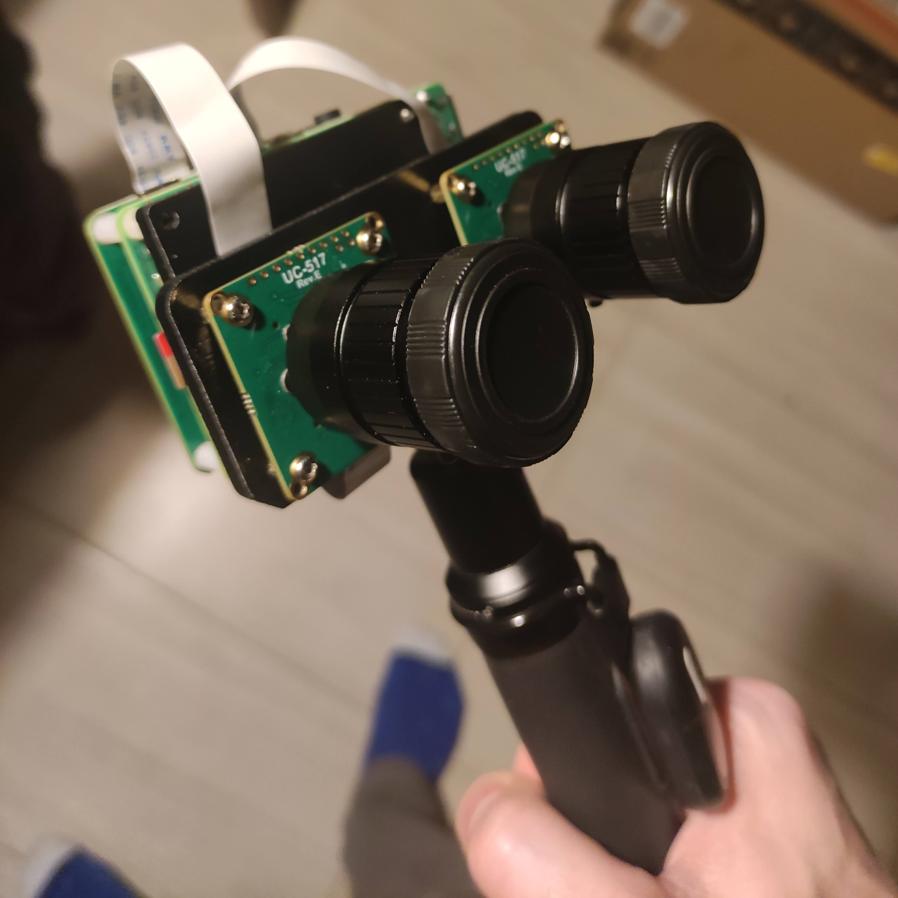

# Stereo reconstruction
Working repository for code related stereo reconstruction using classical solutions

Much of this code is based on lectures given by Professor Cyrill Stachniss where a full photogrammetry playlist can be found [here](https://www.youtube.com/watch?v=SyB7Wg1e62A&list=PLgnQpQtFTOGRYjqjdZxTEQPZuFHQa7O7Y).

An example of stereo reconstruction using this repo is shown here:

   

## Currently implemented

* Zhang's method to compute the camera calibration matrix of a pinhole camera.
    * src/stereo_reconstruction/intrinsics.py
* Computation of the fundamental matrix and essential matrix with RANSAC.  Also computes the relative rotation of the second camera and the baseline (up to scale) between the two cameras.  The rotation + baseline should not be relied upon.  I think it's giving incorrect values but I can't find the source of the issue.
    * src/stereo_reconstruction/extrinics.py
* Working on cleaning the code to compute disparities.